# CCA Programming & Electronics, Spring 2018

This course repository contains homework assignments, useful guides, and code for "Programming & Electronics" at CCA, Spring 2018.

Also included in this repository is the official [course syllabus](syllabus.pdf).

### Week 1: Wednesday, January 17, 2018

Lecture:
- Introductions
- What is programming?
- Goals & course details

Hands-on activities:
- Human Embodiment of Programmer & Robot
  - Programs generally run line-by-line.
  - Repetition, decision making, and recipes break that up.
- [Solving Puzzles](puzzle-sheets.pdf)

#### Building Blocks of Code

In class, we discussed the four basic building blocks of code: actions & recipes, remembering, making decisions, and repetition. 

[Here are some notes.](building-blocks-programs.md)

#### Inspiration

Finally, here are some inspirational videos to get you excited for our class if you're not already:
- Creative Code
  - [Interviews with Practitioners](http://www.youtube.com/watch?v=eBV14-3LT-g)
  - [Casey Reas](https://www.youtube.com/watch?v=_8DMEHxOLQE)
- Basic robots
  - [Coffee-can robot](http://www.youtube.com/watch?v=b0mIshBIbvI#t=24)
  - [Tree-climbing robot](http://www.youtube.com/watch?v=zkpH1BjD6Wc)
  - [Self-balancing robot](http://www.youtube.com/watch?v=Tw9Jr-SPL0Y)
  - [Insect robot](http://www.youtube.com/watch?v=tOsNXg2vAd4#t=120)
  - [Treadbot](http://www.youtube.com/watch?v=YblSltHDbIU)
  - [Velociraptor robot](http://www.youtube.com/watch?v=lPEg83vF_Tw)
- Installations
  - [The Bay Lights](http://thebaylights.org/)
  - [Murmur Wall](http://www.future-cities-lab.net/projects/#/murmurwall/)
  - [Floating Couch](http://vimeo.com/72826106)
  - [Wooden Segment Mirror](https://www.youtube.com/watch?v=BZysu9QcceM#t=36)
  - [Generative design](https://www.youtube.com/watch?v=pNkz8wEJljc)
- Art & Music bots
  - [Textile weaving](https://vimeo.com/71044541)
  - [ReacTable](https://www.youtube.com/user/marcosalonso)
  - [Projection mapping](https://www.youtube.com/watch?v=czuhNcNU6qU)
  - [Laser harp](http://www.youtube.com/watch?v=sLVXmsbVwUs#t=20)
  - [Cubli: Floating Cube](https://www.youtube.com/watch?v=n_6p-1J551Y)
  - [Arc-o-matic](http://vimeo.com/57082262#at=130)
  - [Robo Faber](http://vimeo.com/78771257)
  - [Eggbot](https://www.youtube.com/watch?v=w4cdbV2oaEc)
- Drink-makers
  - [Textspresso](http://www.youtube.com/watch?v=kx9D74t7GD8#t=89)
  - [The Inebriator](http://www.youtube.com/watch?v=WqY7fchs7H0)
- Computer Numerical Control (CNC)
  - [Shapoko / tinyg](http://www.youtube.com/watch?v=pCC1GXnYfFI#t=11)
  - [Makerbot Replicator](http://www.youtube.com/watch?v=NAbiAzYhTOQ)
- Vacuuming
  - [Roomba](https://www.youtube.com/watch?v=0DNkbZvVYvc)

[Homework for Week 1](hw/week1.md)


### Week 2: Wednesday, January 24, 2018

In-class:
- Homework review.
- Translating "pseudo-code" into real code with [Rudy](http://rudy.zamfi.net); here are some notes on the [building blocks of code](building-blocks-code.md).

Workshop:

1. Work through the Rudy puzzles with a partner. Make sure you understand the syntax.

2.  **Challenges**: On puzzle 9, the open canvas:
    1.  Draw four rectangles of various sizes on the canvas.
    2.  Draw 10 parallel vertical lines, 20 squares long, 3 squares apart.
    3.  Define a function, `rect`, that takes four parameters: `x`, `y`, `width`, and `height`, and draws a rectangle on the canvas, at location (`x`,`y`) with the corresponding `width` and `height`.
    4.  Modify the `rect` function so that it takes a fifth parameter, a color to draw the outline with.
    4.  Modify the `rect` function so that it fills in the rectangle instead of just drawing the outline.
    5.  **Extra Challenge**: Define a `line` function, that takes four parameters: `x1`, `y1`, `x2`, and `y2`, and draws a line between the point defined by (`x1`,`y1`) and the point defined by (`x2`,`y2`). There are many ways to approach this challenge! You may find some Internet research instructive.
    6.  **Extra Challenge**: Define a `circle` function that takes three parameters: `x`, `y`, and `r`, and draws a circle of radius `r` centered on the point defined by (`x`,`y`). You find trigonometry helpful for this exercise.

[Homework for Week 2](hw/week2.md)

### Week 3: Wednesday, January 31, 2018

In-class:
- Homework Review.
- Understanding statement evaluation.

Workshop:

#### Class Quilt

Make a patch for the class quilt! Start with the following code:

```javascript
function yourPatch(x, y) {
  noFill();
  stroke(238);
  rect(x, y, 100, 100);
  
  // your code here!
}

background(255);
yourPatch(0, 0); // draw patch at upper-left

background(255);
yourPatch(width-100, height-100); // draw patch at lower-right
```

Modify the `yourPatch` function, replacing `// your code here!` with drawing commands that draw inside the 100-by-100 pixel square. Use `x` and `y` to get yourself started -- all your shapes should appear within the rectangle bounded to the left by `x`, above by `y`, to the right by `x+100` and below by `y+100`. That means that you'll need `x` and `y` (or other variables you create that *depend on* `x` and `y`) in every parameter to every painting function you use.

We'll then take all our functions and pattern them together into a class quilt! Making your functions depend on `x` and `y` means that we can place them anywhere in the quilt by "passing in" the appropriate `x` and `y` coordinates for that place in the quilt.

When you like what you have, change the call your `yourPatch` to draw your patch at `(0, 0)` and `(100, 100)` -- make sure your drawing moves along with the coorinates.

Feel free (but not compelled) to remove the border rectangle when you like what you have!

Here's an example that I came up with for myself:

```javascript
function zamfiPatch(x, y) {
  noFill();
  stroke(238);
  rect(x, y, 100, 100);
  
  // blocky J
  fill(238);
  noStroke();
  rect(x+20, y+20, 60, 20);
  rect(x+40, y+40, 20, 40);
  rect(x+20, y+60, 40, 20);
  
  // overlay of lines
  stroke(0);
  var lines = 3;
  while (lines < 50) {
    line(x+lines, y, x, y+lines);
    lines = lines + 5;
  }
  stroke(200);
  while (lines < 100) {
    line(x+lines, y, x, y+lines);
    lines = lines + 3;
  }
  stroke(255, 127, 0);
  lines = 0;
  while (lines < 50) {
    line(x+100, y+lines, x+lines, y+100);
    lines = lines + 4;
  }
  stroke(0, 64, 127);
  while (lines < 100) {
    line(x+100, y+lines, x+lines, y+100);
    lines = lines + 4;
  }
}
```

You don't have to understand exactly how the code above works -- but do notice that **every single coordinate** parameter of every shape and line has `x` or `y` in it -- usually something added to `x` or `y` -- and that's so that every shape is drawn **relative to `(x, y)`**. That way, whether I run `jdPatch(0,0)` or `jdPatch(100, 100)`, all my shapes are offset by the correct amount.

**Challenge**: Make an animated patch! Draw something slightly different every time your function is called. You can accomplish this using the `random` function, or by keeping variables outside your function, using them to position or color shapes, and then updating them each time your patch function is called. NB: use variables names that are unique to you: preface them with a nickname, for example!

#### Working with Loops

Here's one way of working with loops, and figuring out how to turn a pattern into code:

1. Write down the coordinates of the shapes you want to create in your loop.
2. Find the pattern for those coordinates
  a. Where does it start?
  b. Where does it end?
  c. How much does it change each time?
3. Use that pattern in a *for* loop: `for (var i = START; i < END; i = i + CHANGE) { ... }`
  
For example, to create the following sketch:

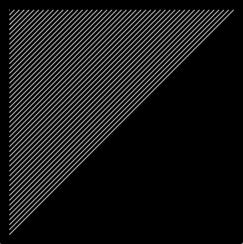

...start by writing down some endpoints for those lines:

```
(20, 20) -> (20, 20)
(20, 30) -> (30, 20)
(20, 40) -> (40, 20)
(20, 50) -> (50, 20)
(20, 60) -> (60, 20)
(20, 70) -> (70, 20)
(20, 80) -> (80, 20)
.
.
.
(20, 480) -> (480, 20)
```

...from these coordinates, we can find a pattern for each of the four parameters we need to draw a line:

- `startX`: always 20
- `startY`: starts at 20, ends at 480, goes up by 10 each time
- `endX`: starts at 20, ends at 480, goes up by 10 each time
- `endY`: always 20

...from this pattern, we can generate a loop that draws these lines, by creating a variable that starts at `20`, ends at `480`, and goes up by `10` each time. We won't call the variable `x` or `y` beacuse we don't use it exclusively for either coordinate.

```javascript
for (var i = 20; i <= 480; i = i + 10) {
  var startX = 20;
  var startY = i;
  var endX = i;
  var endY = 20;
  line(startX, startY, endX, endY);
}
```


#### Loops Workshop

Today, we'll practice loops:

1.  Together, we'll make vertical lines:
    
    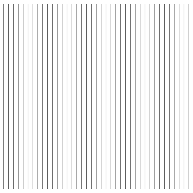

2.  Then, with a partner, you'll make horizontal lines:
    
    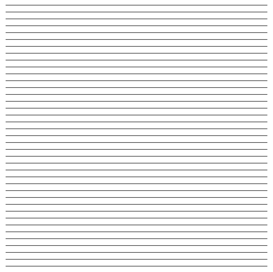
    
3.  Try these concentric circles too:
    
    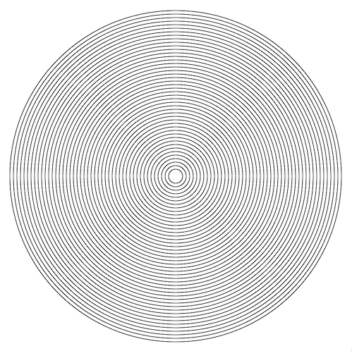

4.  And this cone:

    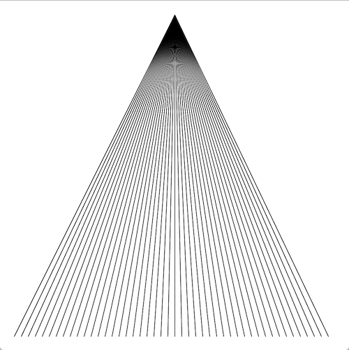
    
5.  Also this diamond:

    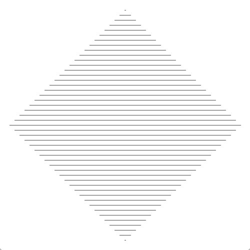
    
6.  What about these taller lines?
    
    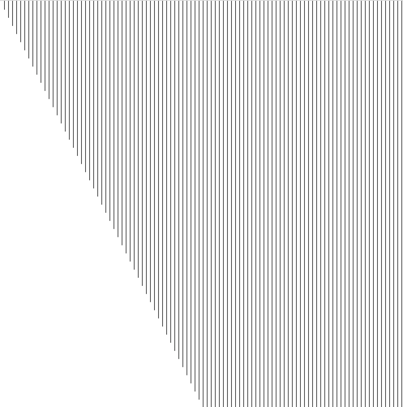
    
7.  **Challenge**: For this you'll need a **loop within a loop**:
    
    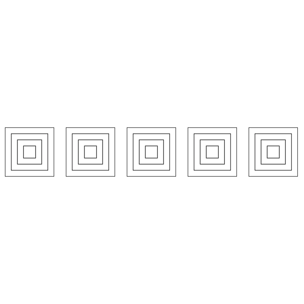

8.  **Challenge**: Now try this grid of circles; you'll need **nested loops** for this one too!
    
    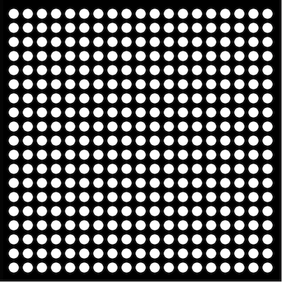

9.  **Extra Challenge:** Using a technique called the "exponential moving average", we can create a smooth easing animation like this:
    
    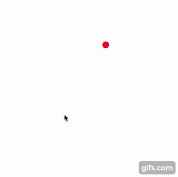
    
    The technique works by one variable to store intermediate values for another variable. For example, in the sketch above, the *x-* and *y-* coordinates of the circle are stored in variables `x` and `y`, which are **eased** to the target values given by `mouseX` and `mouseY`.
    
    "Exponential moving average" is a fancy way of saying: first, pick a fixed **rate** at which the easing occurs for a variable reaching its target. That rate controls how much impact the target has on the value each frame. For exampe, if the rate is 10%, then the new value each frame is 10% the target value and 90% the old value of the variable. Here's some sample code; the key is in the line `x = target*rate + x*(1-rate);`:
    
    ```javascript    
    var rate = 0.1;
    var x = 0;
    var target = 100;
    
    while (true) {
      ellipse(x, 100, 15, 15);
      x = target*rate + x*(1-rate); // rate is 0.1, or 10% -- (1-rate) is 0.9, or 90%
    }
    ```
    
    Each frame, x gets 10% closer to its target.
    
    Modify this code to create a circle that follows the mouse as in the anigif above.

[Homework for Week 3](hw/week3.md)


### Week 4: Wednesday, February 7, 2018

In-class:
- Homework Review
  - State machines, briefly: you are keeping state based on user inputs, and drawing based on that state. Input -> computation -> output.
- Programming for Interaction

#### Class Quilt!

Here's what we have so far -- if you haven't sent me your quilt patch yet, please do so ASAP!

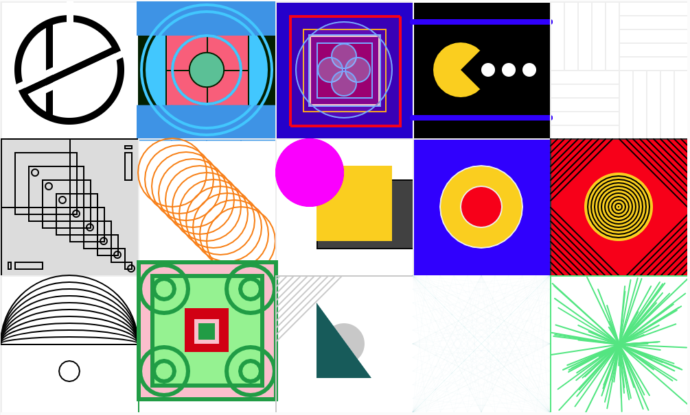

Thanks to all who submitted!

#### Programming for Interaction

So far we've been focusing on the "output" part of programming. Today we'll work with the "input" part.

p5 enables a few different ways of getting user input. In the homework we used keyPressed to handle color changes, but there is a full list of input functions in the [p5.js reference](https://p5js.org/reference/)

For today's workshop, we'll consider a few sketches. First, let's extend one of the exercises from homework. Starting with this code from the homework:

```javascript
function setup() {
  createCanvas(400, 400);
  background(255);
  colorMode(HSB);
  noStroke();
}

var diameter = 10;

function draw() {
  if (mouseIsPressed) {
    ellipse(mouseX, mouseY, diameter);
  }
}

function keyPressed() {
  print(key);
  if (key == 'R') {
    fill(0, 100, 100);
  } else if (key == 'G') {
    fill(100, 70, 100);
  } else if (key == 'B') {
    fill(210, 100, 100);
  } else if (key == 'T') {
    fill(180, 100, 100);
  } else if (key == 'Y') {
    fill(60, 100, 100);
  } else if (key == 'P') {
    fill(310, 100, 100);
  }

  if (key == 1) {
    diameter = 10;
  } else if (key == 2) {
    diameter = 20;
  } else if (key == 3) {
    diameter = 30;
  }

  if (key == 'E') {
    diameter = 30;
    fill(0, 0, 100);
  }
}
```

**Exercise:** Can we modify this code so that the painting only happens while the corresponding key is pressed?

Next, consider this sketch: https://alpha.editor.p5js.org/jd/sketches/SkyDECDIz

Let's add a few more sounds, and extend this sketch:

**Exercise:** Add three more sounds to the assets folder, and play different sounds based on different keypresses.

**Exercise:** Use `mousePressed` to change something about the sounds or how they are played.

Now, consider this sketch: http://alpha.editor.p5js.org/jd/sketches/S1n5FmOLz

**Exercise:** Add some per-key visual feedback. In the current code, there's a single "playing" variable that tracks whether any key is playing. Change this "state" so that there's a state per key!

**Exercise:** Do something fun or interesting with this sketch.

