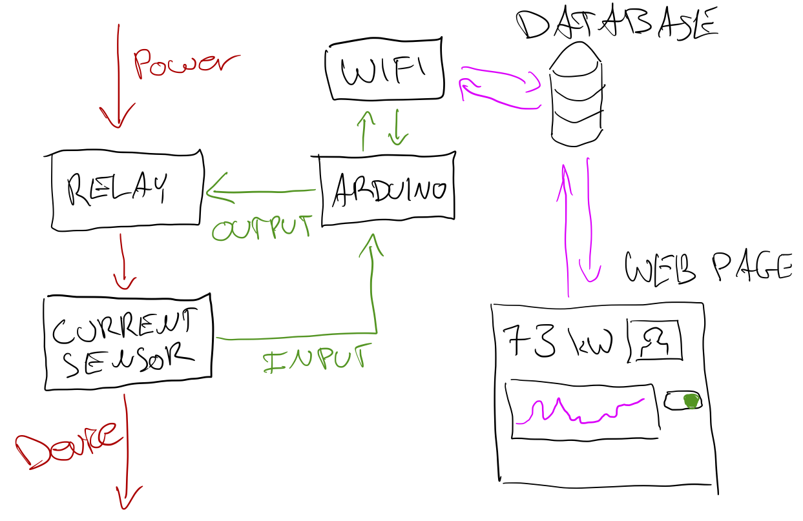

# Internet-connected Smart Plug

I propose to build an internet-connected smart plug: a device that allows you to view the power consumption over time of your electronic devices as well as to turn them on or off remotely.

## Summary

The Internet-connected smart plug is a small box that you plug into an outlet. Inside the box are a current sensor and a wifi chip that allow the box to measure power usage data and transmit that data to a database in the cloud. A (responsive) web page allows the owner to see current power usage a well as a graph of historical power usage and how it has changed over time. That same web page allows the owner to turn on or off the connected device, as well as set conditions for the device to be turned on or off automatically, either according to a set schedule, or based on current data. A cloud database service will store all the historical power data and act as the connector between the web page and the physical device.

The main goal of the project is to help people monitor their power usage over time and remotely access and turn on or off their devices if they don't need them. People will interact with the device in two ways: physically by plugging thing in and with a power switch on the device, as well as through the web page described above.

## Component Parts

On the hardware side, there's a small box you plug into an outlet, into which you then plug in whatever electrical device you like. That box will need a few main components:
- A relay, to control power to the device. (OUTPUT)
- A current sensor, to measure the power usage of whatever is plugged in to the device. (INPUT)
- A wifi chip, to transmit power usage data to the cloud and receive on/off instructions from the cloud. (INPUT & OUTPUT)

On the software side, there's a web page that shows you the power consumption over time of whatever is plugged in to your outlet, and allows you to remotely turn on or off the power to whatever is plugged in. This software will have a few main components:
- A database, to store reported current usage data. (DATA)
- A user login system, to uniquely identify people coming to the site and connect to the correct devices. (DATA)
- A graphing system, to draw out historical power usage data. (OUTPUT)
- A few buttons to control the on/off state of the devices. (INPUT)

### Block Diagram

## Challenges

I anticipate working with 120V to be challenging and require special consideration as the failure modes are potentially lethal. I plan to research best practices with working on high-voltage projects and will apply those practices to my work.

Working with wifi may also prove challenging, and is a requirement for this project; making sure I can build this pieces is a top priority.

I also have limited experience working with graphing systems and cloud databases, but my experience suggests that this project is doable, if complicated. In order to reduce the risk, I plan to experiment with these two pieces a little more before committing to this component of the project. (If this doesn't work out, there will not be a "historical data" piece of the project, but everything else should work fine.)

Finally, building a web interface can also be quite complicated, so I expect that will take a lot of time to get right, but a rough version should suffice for the project.

## Timeline

What parts of the project do you anticipate you will complete in each of the next 5 weeks?

- Week 1: Write proposal, borrow a WiFi Arduino, make sure I can get WiFi to work
- Week 2: Acquire hardware components: relay, current sensor, WiFi, and build a prototype circuit with those pieces.
- Week 3: Build a first version of the software that displays current power usage and an on/off switch.
- Week 4: Integrate all the components together and debug.
- Week 5: Present complete project.
