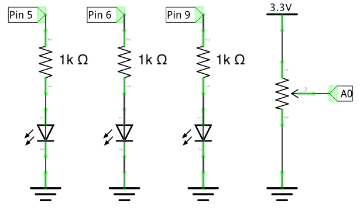

### Homework 8 (due Tuesday, March 13, 2018)

In this assignemnt, you'll practice building circuits on your breadboard from a schematic, and then you'll exercise your creative skills to build a set of status notifications using just a single pixel -- one LED!

Before you start writing any code, **make sure to browse through the [Arduino reference](https://www.arduino.cc/reference/en/) to see what functionality is available to you!**

#### Practice Breadboarding

**Assignment**: Follow the instructions in [From Schematic To Breadboard](../schematic-instructions.pdf) to breadboard a potentiometer and an LED together, in two separate circuits.

**Assignment**: Extend your circuit to include two additional LEDs, for a total of 3, as shown in this schematic:

Note: You can find a 1K resistor in the Hybrid Lab -- feel free to use another value too, anything over about 100 will do. Higher resistances yield dimmer LEDs, though!

Take a photo of your circuit and save it to your homework repository as `three-leds-and-a-pot.jpg`.

**Assignment**: `level-meter.ino` -- Write code that implements a "level meter" using these three LEDs. When the potentionmeter is turned all the way counter-clockwise, all LEDs should be off. As you turn it clockwise, each subsequent LED should turn on as the rotation passes 1/4, 2/4, and 3/4 of the way around. You can base your code on the Analog Input sketch we used in class (found in the Arduino IDE under `File` > `Examples` > `Analog` > `AnalogInput`). You won't need blinking, but you will need an `if` statement that checks the `sensorValue` to see how rotated your potentiometer is.

**Challenge**: `blink.ino` -- Modify the code to blink the topmost LED in your meter.

**Challenge**: `fade.ino` -- Modify the code to fade the topmost LED from least bright to most bright as the rotation progresses through the quarter for that LED.

#### Single-pixel Vocabulary

**Assignment**: You are an AI agent on a near-future iPhone tasked with communicating the content of each of the following notifications messages using a single LED. An engineer might immediately think "easy-peasy, I'll just use Morse code!" -- but this response doesn't consider that your user is unlikely to visually parse (or even know of) Morse code. Think instead of what piece of the message you could reasonably get across with a single pixel; how might you communicate urgency? Or compassion? Get creative!

- "Your homework assignment is overdue." (Save your Arduino code as `overdue.ino` in your homework repository.)
- "You have a doctor’s appointment tomorrow." (`doctor.ino`)
- "Mom says: love you sweetie, have a great day!" (`mothers-love.ino`)
- "Urgent: your roof is leaking onto your bed - please come take care of it immediately." (`urgent.ino`)
- "You are following directions, but you took a wrong turn." (`wrong-turn.ino`)
- "You have a meeting coming up in 5 minutes." (`meeting.ino`)

**Challenge**: Using `analogWrite` and maybe `millis`, reproduce [Apple's "breathing" sleep indicator](https://www.youtube.com/watch?v=ZT6siXyIjvQ).
